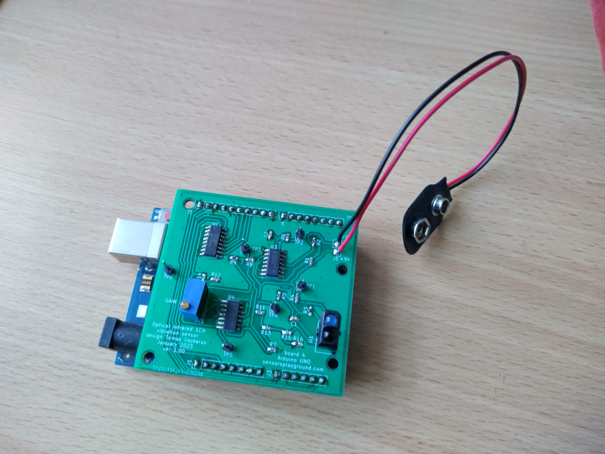

# Arduino UNO vibrometer

## General Introduction

It's expansion board for Arduino UNO.
Vibrometer is based on TCRT5000 IR sensor and MCP3008 adc.
KiCAD 6.0 was used.
It's tested and working.
Arduino is used only to send out ADC values together with time stamps.
C# application is coming, I am eliminating few last bugs. It will calculate frequency of harmonic vibrating object.
I was not able to eliminate noise in USB supply (50 Hz), so I use additional 9V battery - I am working on eliminating this.

## About the physical principle

It's light intensity distance sensor. The closer the object is, the more light is reflected back to phototransistor.
However, the correct distance can not be measured without calibration, because different surfaces
reflect different % of the light back. This will be solved by more advanced HW version later (hopefully I'll not give up the topic :-)
Working distance is few cm.
It can be also used as a detector of infra light intensity modulation.
(for example you can measure what frequency has lamp on your table in the office ;-)

## About the electrical design

I plan to describe here:
   - how filters are calculated
   - what are the individual parts of the circuit and how do they work
   - what signals are on the TestPoints
Shortly: You can get analog output from TestPoint 5 and GND is TestPoint 6.

## Next steps

  - testing and testing...
  - speed up Arduino code
  - eliminate 9V battery
  - finish C# app
  - thinking about ARM processor (now testing RPi)
  - thinking about more complicated physical principle (planning modulation tests, reading about self-mixing)
 

Enjoy!

Tomas Gajdarus
