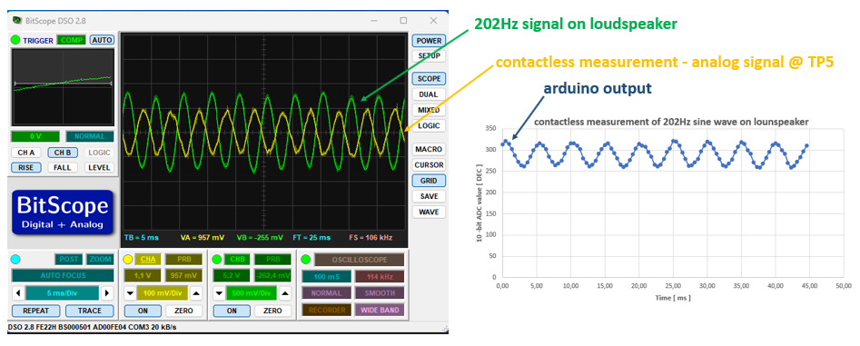
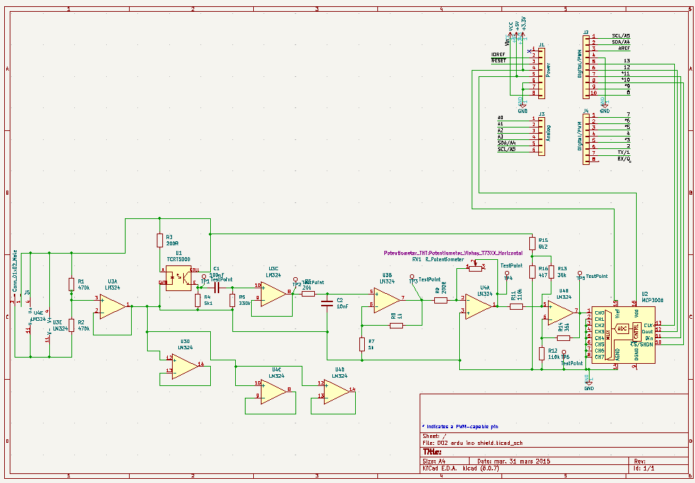

# Arduino UNO contactless vibrometer

## General Introduction

It's expansion board for Arduino UNO.
Vibrometer is based on TCRT5000 IR sensor and MCP3008 adc.
I used KiCAD 6.0.
It's tested and working.
Arduino is used only to send out ADC values together with time stamps.
C# application is coming.
Up to now I was not able to eliminate noise comping from USB supply (50 Hz), so I use 9V battery to supply power to the circuit.

## Physical principle

It's light intensity distance sensor. The closer the object is, the more light is reflected back to phototransistor.
However, the correct distance of vibrating object can not be measured without calibration. I hope I'll solve later.
Working distance is few cm.

## Arduino code

I use this SW library:
[Fast MCP3008 library for Arduino Uno](https://github.com/arithmechanics/fast-MCP3008)

I modified the original code, I am sending out data in this format:

**ADC VALUE** (hex, 10-bit adc) ***(space)*** **MICRO-SECONDS** (hex, result of Arduino function ***micros()***)

## Electrical circuit
**Signal path:**

Signal -> High pass filter -> Low pass filter -> Amplifier -> Level shifter -> ADC (here MCP3008) -> Arduino Uno

**My electrical design is inspired by:**

[Matiss Malahs - Design of a Low Cost Laser Vibrometer System](https://www.theseus.fi/handle/10024/89919)

[Heart Rate Measurement using PPG](http://www.ee.iitb.ac.in/~stallur/wp-content/uploads/2017/02/Heart-Rate-Measurement-using-PPG1.pdf)

## Details of the electrical circuit
I needed to do adjustments:
   - high pass filter is calculater fc = 4.82 Hz
   - high pass is also removing away DC part of the signal
   - low pass is calculated fc = 796 Hz
   - **everythnig above 200Hz looks ugly with actual data acqusition speed**
   - TestPoint 1 - direct output from phototransistor (proportional to light intensity)
   - TestPoint 2 - voltage after high pass filter
   - TestPoint 3 - voltage after low pass filter
   - TestPoint 4 - voltage after amplification
   - TestPoint 5 - signal before entering ADC
   - TestPoint 6 - ground
   
## Next steps

  - testing and testing...
  - speed up Arduino code
  - eliminate 9V battery
  - finish C# app
  - thinking about ARM processor (now testing RPi)
  - thinking about more complicated physical principle (planning intensity modulation tests, reading about self-mixing)
 
 
 
**More about testing and other details:**

[sensorsplayground.com](http://www.sensorsplayground.com/)

Enjoy!

Tomas Gajdarus

tomas (dot) gajdarus (at) seznam (dot) cz
